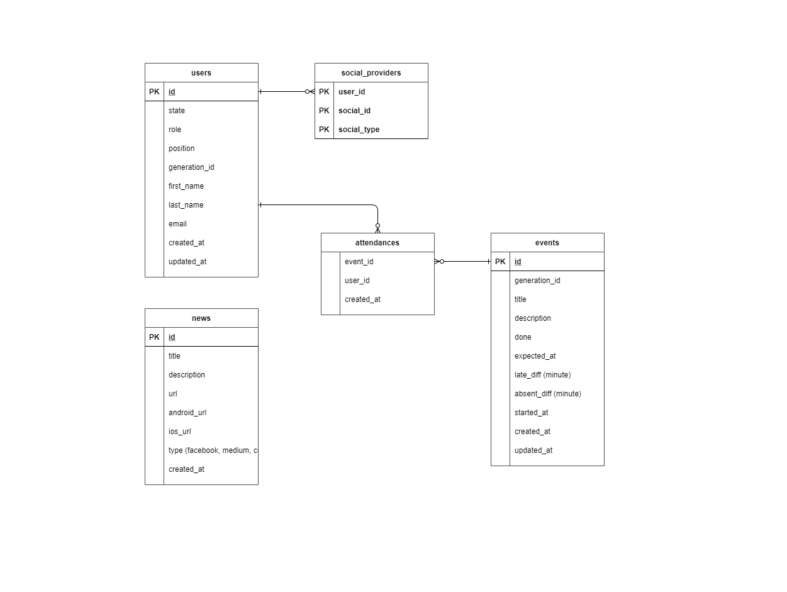

# DDD Attendance API
DDD 활동 출결 확인을 위한 web backend 입니다.

## Key Features
 - 출결 관리
 - 뉴스 리스팅
 - 커리큘럼 확인

## Quick Start
TBA

## Documentation
API Doc : `server:port/doc`

## Skill Stack
- Language: Kotlin (JVM / Java 11)
- Framework: Spring boot 2.5.2
- Dependencies
    - To Do

## Infra Architecture
 - AWS Elastic beanstalk with Docker
 - AWS RDS with MySQL
 - AWS Route53
 - Swagger API docs
 - Kotlin with spring boot

## ERD

## License
[GPL License](https://www.gnu.org/licenses/gpl-3.0.html) :

Copyright (c) 2021 6th DDD backend team

 - [Jaeseong Lee](https://github.com/RebirthLee)
 - [Myeongseok Ko](https://github.com/RbertKo)